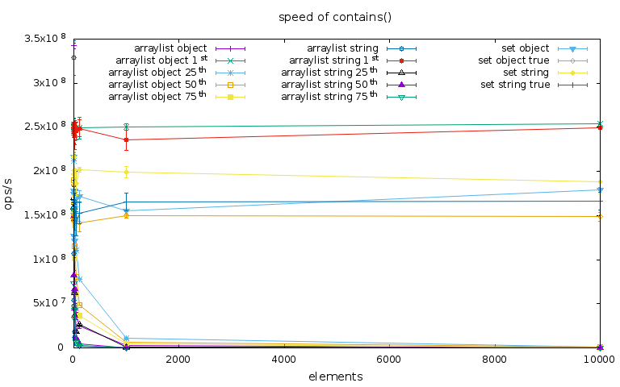
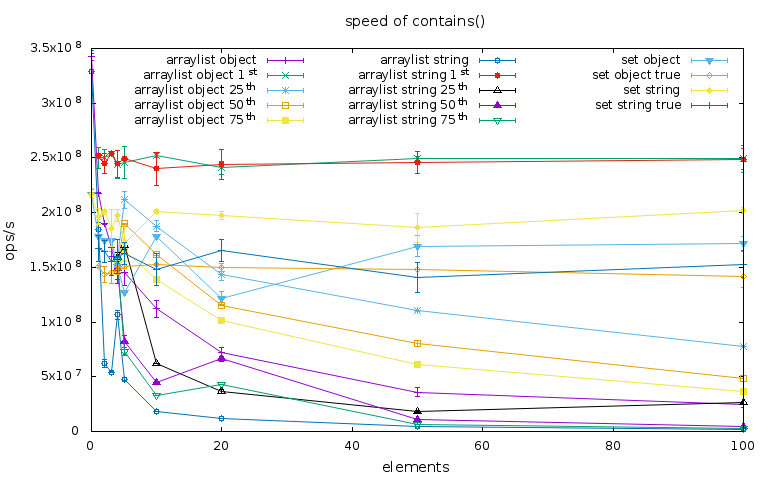
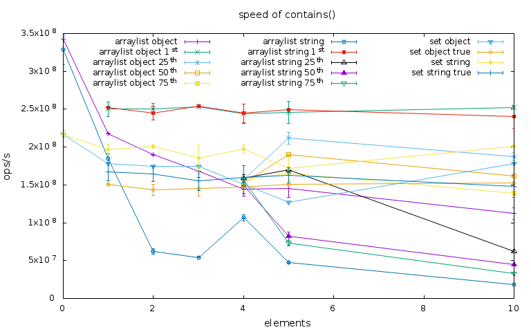
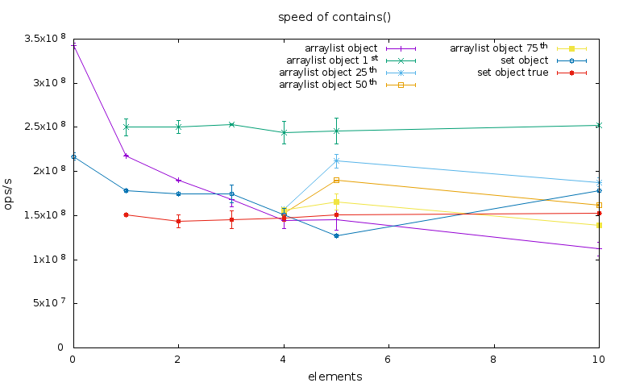
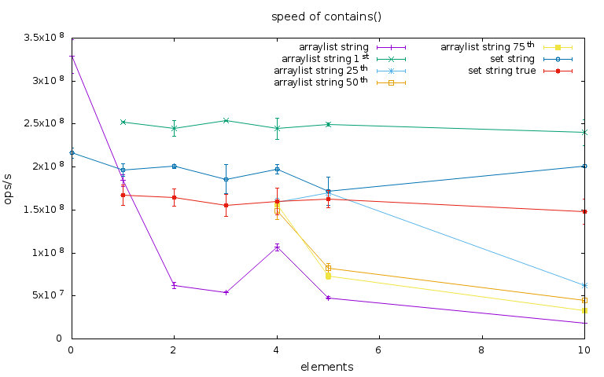

# Speed comparison of Java's `ArrayList::contains` and `HashSet::contains`

I've wanted to play around with [JMH][jmh], the Java Microbenchmark Harness,
for a while. I recently came across an `ArrayList` used to express the
semantics of set containment, wondered if that could ever be a good tradeoff,
and decided to use that as a case study.

## Premise

`contains` is a rarely useful operation, often better replaced by `get` and a
null-check, but occasionally a presence-check really is the only valuable
operation and there `contains` is worthwhile.

There are numerous benchmarks of different Java collection libraries. This one
only cares about standard Java 8, and only about the *speed* of the
operation&mdash;not the difference in memory overhead.

Algorithm analysis tells us that `HashSet::contains` will execute faster than
`ArrayList::contains` for *sufficiently large n*. In practice, however, *n* is
often *small* and flaunts asymptotic complexity, and advancements in hardware
manufacturing have made [locality of reference][wiki-locality] a deciding
factor in execution speed.

Searching a `HashSet` has [direct-access][wiki-random-access] characteristics,
making it [an O(1) operation on average][wiki-avg-constant]. The worst-case
search degenerates to [linear search][wiki-linear] that has both a worst-case
and an expected cost of O(*n*). `ArrayList` only uses linear search.

Linear search has the curious property that, under the right circumstances, it
performs on average only *n*/2 comparisons instead of
*n*.

### Hypothesis

`HashSet` is a safe choice for `contains`-suitable operations for any
unpredictable input. `ArrayList` will match or outperform `HashSet` for very
small *n* but the boundary between *small* and *large* is so negligible that
expressing behavioural semantics trumps performance considerations.

## Conclusion

* Use `HashSet`; `HashSet::contains` is quite fast, wherefore `get` is quite
  fast.
* `HashSet` outperforms `ArrayList` already at 4 elements.
* `HashSet<String>` and `HashSet<Object>` are neck-and-neck, the former
  slightly outperforming the latter.
* For `HashSet<String>`, finding nothing is 20% to 25% faster than finding
  something.
* If the collection has only a single element, `ArrayList` greatly outperforms
  `HashSet`. If you care about only a specific element at a known position,
  direct access is unbeatable. However, in this case, if not constrained by the
  API, eliminating the collection wrapper altogether will be better in every
  way.

## Benchmark

The benchmark suite allocates a number of unsorted `ArrayList` and `HashSet`
instances of size 0, 1, 2, 3, 4, 5, 10, 20, 50, 100, 1.000, and 10.000. As the
size increases I expect algorithmic complexity to dominate locality of
reference, and I expect that to happen at a small size.

The `HashSet` benchmarks do and do not find a contained element (i.e.,
`contains` returns true and false). The `ArrayList` benchmarks are more
complex, with benchmarks where the contained element is at index 0 or
percentiles 25, 50, or 75, and a benchmark that does not find the element. This
demonstrates the effect of good and bad inputs to linear search.

Those suites then exists for both type parameters `Object` and `String`. The
former represents, as a baseline, the general case where a (custom) type has
not overridden `hashCode` or `equals`. The latter represents the opposite case,
and I chose `String` because of its runtime-ubiquity and well-understood
`hashCode` and `equals` implementations.

Here is how to interpret the output:

Benchmark                     | Collection          | Size   | Match found?
----------------------------- | ------------------- | ------:| ---
`arraylist_object_00000`      | `ArrayList<Object>` | 0      | No
`arraylist_object_1st_00020`  | `ArrayList<Object>` | 20     | At index 0
`arraylist_string_25th_00005` | `ArrayList<String>` | 5      | At 25th percentile
`set_object_true_10000`       | `HashSet<Object>`   | 10.000 | Yes
`set_string_00000`            | `HashSet<String>`   | 0      | No

I should have used JMH's `@Param` to capture all this variance but when I
learned how to use it I had already built everything, and I didn't think this
problem was quite important enough to restructure it just for that.

### Analysis

This is a not-so-detailed analysis of the results included in the `sample/`
directory, generated with `DESTDIR=sample/ make all`.

The graph of the full benchmark suite is reassuringly unsurprising:

.

In the middle we have all the `HashSet` benchmarks, with `String`-miss notably
higher than the other three. `ArrayList`'s direct-access benchmarks are upwards
of 100 million operations/second faster than that, while all the other
`ArrayList` benchmarks are way down at the bottom.

At a resolution of 100 elements the graph becomes more interesting but it also
shows that really nothing changes after 20 elements:

.

At a resolution of only 10 elements we see that `ArrayList` is also unbeatable
in the niche of empty collections:

.

That's not surprising either: `ArrayList` can skip [iterating over an empty
backing array][jdk-arraylist-contains] while `HashSet` always [has to hash the
candidate element][jdk-hashmap-containskey].

We also see that misses for `ArrayList<String>` plummet immediately, and
`ArrayList<Object>` generally outperforms `ArrayList<String>`.

If we only consider the `Object` benchmarks we can see that, up to around 5
elements, both `ArrayList` and `HashSet` are fairly close:

.

In fact, at exactly 5 elements, `ArrayList` manages to just outperform
`HashSet`, although at 4 elements they're tied and at 10 elements `HashSet` has
caught up again. 

If we instead look at the `String` benchmarks we see `ArrayList` soundly
beaten:

.

The difference between hit and miss for `HashSet` is most likely caused by the
need to call `equals` for a hit. Hash collision *could* have been a factor, so
I write a naive program to see if that might be it (`make
count-unique-hashcodes`), but it doesn't look like it.

I am not sure about the difference between `ArrayList` miss and direct-access
for size 1. [The implementation][jdk-arraylist-contains] does no extra work for
misses, and in fact `String::equals` short-circuits so superficially misses
have the potential to run faster. Both the hit and miss candidate elements are
known by the benchmark up-front so I would expect the JVM to optimise both
cases similarly. I saw this pattern in trial runs, too. If any of this were
actually important I would have spent time looking into that.

## Appendix: build and run

The repository includes tooling to build and execute the benchmark and
transform the result into a series of graphs. You should be able to run the
benchmark on any platform but the post-processing requires various GNU tools.
On Windows you might want to run this from a Linux-like subsystem such as
MSYS2, and on macOS you might need to install non-ancient versions of those GNU
tools using something like Homebrew.

0. Install JDK 8 and Maven.
0. Run `[DESTDIR=foo/] make all` to generate all the things, either to the
   current directory or the optional `DESTDIR` prefix.

## Appendix: environment information

    $ java -version
    openjdk version "1.8.0_131"
    OpenJDK Runtime Environment (build 1.8.0_131-8u131-b11-0ubuntu1.17.04.1-b11)
    OpenJDK 64-Bit Server VM (build 25.131-b11, mixed mode)

    $ lscpu | awk '/Model name/,/L3/'
    Model name:            Intel(R) Core(TM) i5-3570K CPU @ 3.40GHz
    Stepping:              9
    CPU MHz:               1634.423
    CPU max MHz:           3800,0000
    CPU min MHz:           1600,0000
    BogoMIPS:              6806.80
    Virtualization:        VT-x
    L1d cache:             32K
    L1i cache:             32K
    L2 cache:              256K
    L3 cache:              6144K

    $ head -1 /proc/meminfo
    MemTotal:        8132904 kB

[jdk-arraylist-contains]: http://hg.openjdk.java.net/jdk8/jdk8/jdk/file/687fd7c7986d/src/share/classes/java/util/ArrayList.java#l284
[jdk-hashmap-containskey]: http://hg.openjdk.java.net/jdk8/jdk8/jdk/file/687fd7c7986d/src/share/classes/java/util/HashMap.java#l594
[jmh]: http://openjdk.java.net/projects/code-tools/jmh/
[wiki-avg-constant]: https://en.wikipedia.org/w/index.php?title=Best,_worst_and_average_case&oldid=773533533#Data_structures
[wiki-linear]: https://en.wikipedia.org/w/index.php?title=Linear_search&oldid=781163169
[wiki-locality]: https://en.wikipedia.org/wiki/Locality_of_reference
[wiki-random-access]:https://en.wikipedia.org/wiki/Random_access
